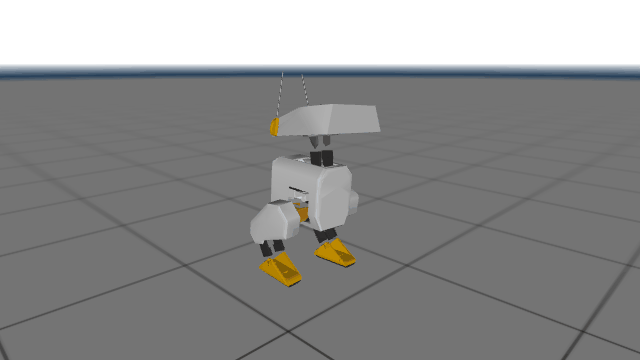
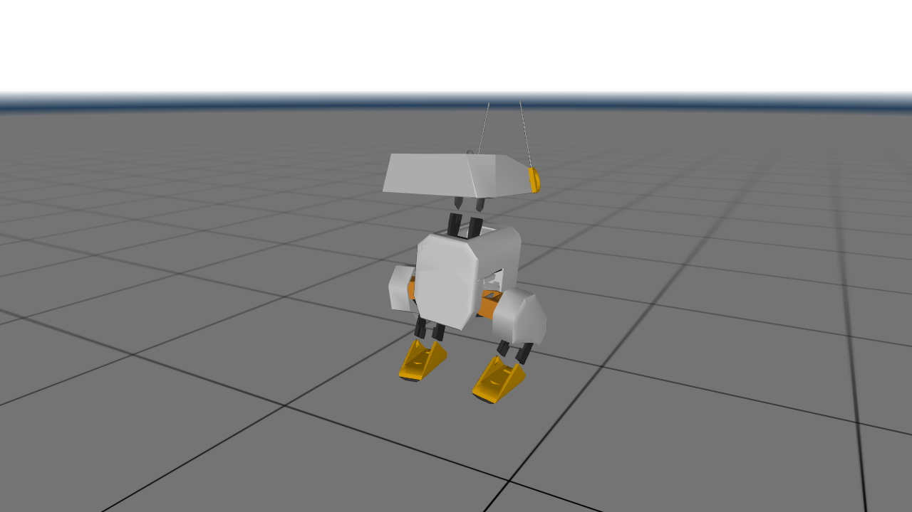
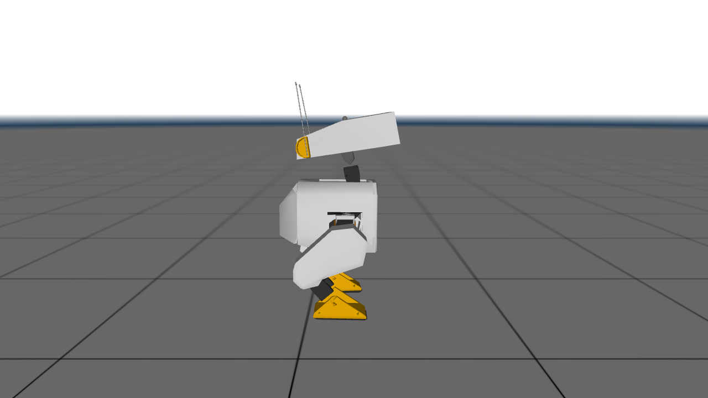
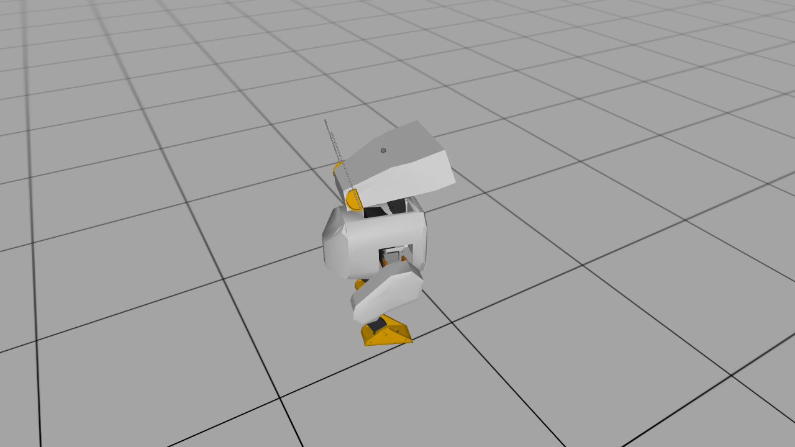
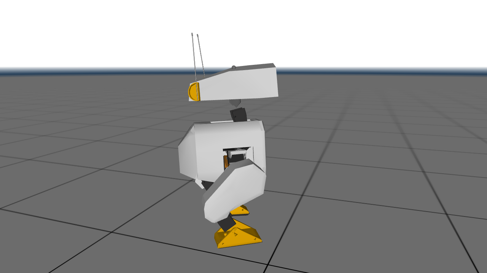

# Duck simulator + keyboard teleop

Runs the trained Open Duck Mini v2 walking policy in MuJoCo and lets you drive it from the keyboard.
Needs only `mujoco`, `onnxruntime` and `numpy`: no GPU, CUDA or training frameworks.

**Python:** 3.10 to 3.14 all work (pip picks matching wheels). **3.12 is recommended.** Run every command from the repo root (`brown-duck/`).



| Standing | Walking (W) | Turning (A) | Head mode (H, then ←) |
|---|---|---|---|
|  |  |  |  |

The pictures are rendered offscreen from the same scene, so the real viewer window looks like this,
plus whatever camera angle you pick with the mouse.

Pick **one** setup: conda (any OS) or a plain venv (per-OS steps below).

## Option A: conda (macOS, Linux, Windows)

If you have [Miniconda](https://docs.anaconda.com/miniconda/) or Anaconda:

```bash
conda env create -f sim/environment.yml
conda activate brown-duck
```

Then run the sim:

- macOS: `mjpython sim/teleop.py`
- Linux: `python sim/teleop.py`
- Windows (Anaconda Prompt or PowerShell): `python sim\teleop.py`

Next time: `conda activate brown-duck`, then the run command. To update after `requirements.txt` changes:
`conda env update -f sim/environment.yml --prune`. To remove it: `conda env remove -n brown-duck`.

## Option B: venv

### macOS

```bash
python3 -m venv .venv && source .venv/bin/activate && pip install -r sim/requirements.txt
mjpython sim/teleop.py
```

On macOS the viewer must run under `mjpython` (installed with `mujoco`), not `python`.

### Linux

```bash
python3 -m venv .venv && source .venv/bin/activate && pip install -r sim/requirements.txt
python sim/teleop.py
```

### Windows (PowerShell)

```powershell
py -m venv .venv; .venv\Scripts\activate; pip install -r sim\requirements.txt; python sim\teleop.py
```

Next time, just activate the venv and run the last command.

## Controls

Click the viewer window first so it has keyboard focus. Each key press sets a command that stays
active until the next key (the viewer doesn't report key releases).

| Key | Walk mode | Head mode |
|---|---|---|
| W / ↑ | walk forward | look up |
| S / ↓ | walk backward | look down |
| A / D | turn left / right | head yaw left / right |
| ← / → | step sideways left / right | head yaw left / right |
| Q / E | turn left / right | head roll left / right |
| Space | stop | center head |
| H | toggle walk ↔ head mode | |
| P / ; | step frequency + / − | |

The terminal prints the active command whenever it changes. Mouse: left-drag rotates the camera,
right-drag pans, scroll zooms, double-click a body to select it, Ctrl+right-drag pushes it.
Quit by closing the window or pressing Ctrl+C in the terminal.

The MuJoCo viewer binds every letter key to a display toggle (W = wireframe, S = shadows, D = hide
static bodies like the floor, …). `teleop.py` resets those toggles automatically, so you may see one frame flicker at most.

Options: `--policy path.onnx`, `--scene path.xml`, `--standing`, `--save_obs` (writes
`mujoco_saved_obs.pkl` on exit).

## Check that it works without a window

```bash
python sim/test_headless.py
```

This presses W, A and Space via the key callback and asserts the duck walked at least 0.2 m forward
and didn't fall. It ends with `PASS`.

## Troubleshooting

- **macOS: `RuntimeError: launch_passive requires that the Python script be run under mjpython`.**
  Use `mjpython sim/teleop.py` (with the venv or conda env active) instead of `python`.
- **Linux over SSH, or WSL with no window / `could not initialize GLFW`.** The viewer needs a display.
  Run it on a machine with a desktop, use WSLg (Windows 11) or X forwarding (`ssh -X`), or run
  `python sim/test_headless.py`, which needs no display.
- **`No matching distribution found for onnxruntime` (or a long source build).** Your Python is too
  new or too old for the available wheels. Use the conda env (it pins Python 3.12), or install
  Python 3.12, recreate the venv (`rm -rf .venv`, or delete the folder on Windows), and reinstall.
- **`conda: command not found` / `conda activate` does nothing.** Run `conda init` for your shell
  (`conda init zsh`, `conda init powershell`, …) and open a new terminal.
- **`mjpython` runs the wrong Python (macOS).** Make sure the env is active (`which mjpython` should
  point into `.venv` or `envs/brown-duck`).
- **Windows: "running scripts is disabled on this system" when activating.** Run
  `Set-ExecutionPolicy -Scope Process RemoteSigned` in that PowerShell window, then activate again.
- **Duck falls or acts strangely.** Press Space to stop. Very high step frequency (P pressed many
  times) is outside what the policy was trained on.

## Troubleshooting log

Hit a problem that isn't covered above? Add a row (via pull request) once you've fixed it.

| OS | Python | Problem / error message | Fix | Who |
|---|---|---|---|---|
| | | | | |

## What's in this folder

| Path | What it is |
|---|---|
| `teleop.py` | the sim: loads the model, runs the policy at 50 Hz, reads the keyboard |
| `test_headless.py` | no-window smoke test (see above) |
| `model/` | MuJoCo model of the duck (`scene_flat_terrain.xml` loads `open_duck_mini_v2.xml` + `assets/` meshes) |
| `policies/BEST_WALK_ONNX_2.onnx` | trained walking policy (14 joints, legs + head) |
| `data/polynomial_coefficients.pkl` | reference gait; sets the step period |
| `onnx_infer.py`, `poly_reference_motion_numpy.py` | small helpers from upstream |
| `requirements.txt` / `environment.yml` | pip deps / conda env (`brown-duck`, Python 3.12) |
| `CREDITS.md` | upstream sources and license notes |

Don't edit `model/`, actuator parameters or the policy: the policy only works with this exact
robot model and joint order.

See [CREDITS.md](CREDITS.md) for where these files come from.
